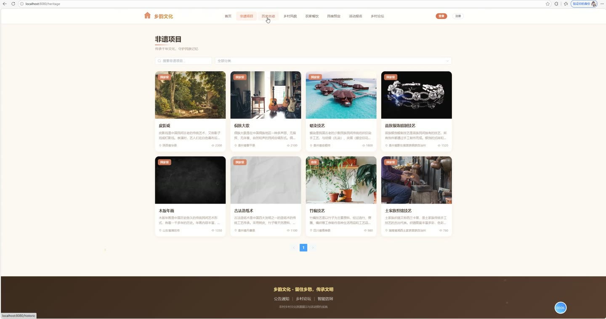
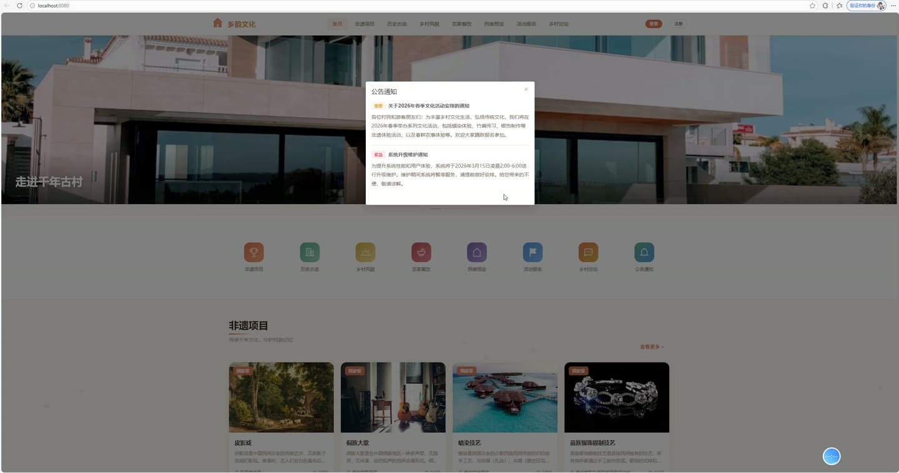
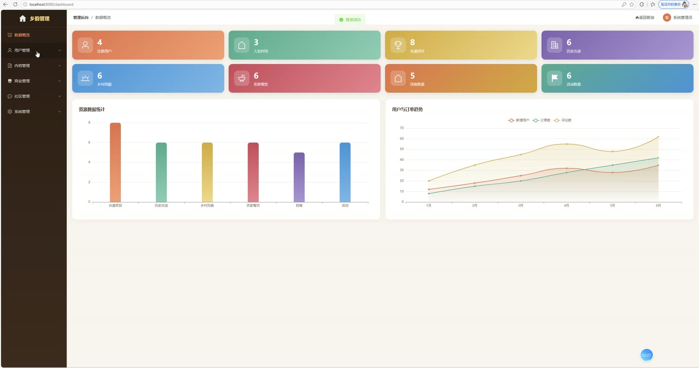
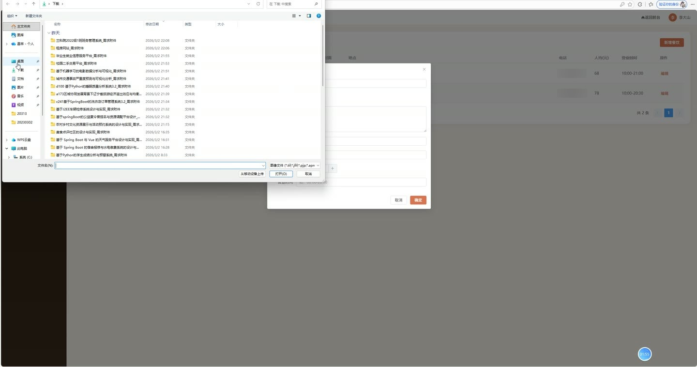

# (附文档)Springboot3+Vue3+MySQL 农村乡村文化资源展示与活动预约系统

**技术栈**：Springboot3、Vue3、MySQL

### 系统简介

本系统是一套基于 SpringBoot3 + Vue3 + MySQL 的农村乡村文化资源展示与活动预约平台，采用前后端分离架构。系统面向普通用户、管理员、乡村商家（村民）三类角色，提供非遗文化、历史古迹、乡村风貌、农家餐饮、民宿、乡村活动、论坛交流、AI智能咨询等核心功能，并内置基于用户行为的协同过滤推荐算法，实现文化资源的个性化推荐。
 
### 核心功能
 
### 普通用户端

- 用户注册与登录：支持用户名密码注册，注册后默认角色为普通用户，密码采用DES加密存储，登录成功后签发JWT令牌

- 个人信息管理：查看个人资料、修改昵称/头像/手机号/邮箱等基本信息，支持修改登录密码（需验证原密码）

- 非遗文化浏览：查看非遗项目列表（支持关键词搜索、按分类筛选），进入详情页可查看图文介绍、视频音频、传承人、地理位置等信息，浏览量自动累加

- 历史古迹浏览：查看历史古迹列表（支持关键词搜索、按分类筛选），详情页展示时代、保护级别、多媒体资源等信息，浏览量自动累加

- 乡村风貌浏览：查看乡村风景列表（支持关键词搜索、按分类筛选），详情页展示季节特色、多媒体资源等信息，浏览量自动累加

- 农家餐饮预约：浏览餐饮商家列表（按评分排序），查看商家详情，提交预约订单（选择日期、时段、用餐人数），生成唯一预约单号

- 民宿在线预定：浏览民宿列表（仅展示审核通过且上架的民宿），查看民宿详情，提交入住订单（选择入住/离店日期，自动计算总价），支持在线支付（模拟）和取消订单

- 乡村活动报名：浏览活动列表（按开始时间排序），查看活动详情（含地点、时间、人数限制、费用），提交报名申请，报名后可在"我的报名"中查看审核状态

- 论坛交流互动：浏览帖子列表（置顶优先、按时间排序），查看帖子详情（浏览量累加），发布新帖子（支持上传图片），对文化资源发表评论

- 内容收藏：对非遗、古迹、风貌等文化资源添加/取消收藏，查看我的收藏列表，支持收藏状态实时检测

- AI智能咨询：向AI助手提问乡村文化相关问题，系统异步调用DeepSeek大模型自动回复，回复失败时转入待人工处理状态

- 个人中心聚合：集中查看我的民宿订单（含支付/取消操作）、餐饮预约记录、活动报名记录、收藏列表

- 行为记录与推荐：系统自动记录用户的浏览/收藏/评论行为，基于协同过滤算法（余弦相似度）为用户推荐相似用户喜欢的文化内容，未登录时推荐热门内容
 
### 管理员端

- 仪表盘统计：查看系统核心运营数据总览

- 用户管理：分页查询用户列表（支持用户名/昵称关键词搜索、按角色筛选），新增用户（默认密码123456）、编辑用户信息、删除用户、启用/禁用用户账号

- 分类管理：管理文化资源分类（非遗/古迹/风貌/餐饮/民宿/活动），支持按类型筛选，设置分类名称、图标、排序号，支持新增/编辑/删除

- 非遗项目管理：分页查询非遗列表（支持关键词搜索），新增/编辑/删除非遗项目，维护封面、图片集、视频/音频、传承人、级别、经纬度等字段

- 历史古迹管理：分页查询古迹列表（支持关键词搜索），新增/编辑/删除古迹，维护时代、保护级别、多媒体资源、经纬度等字段

- 乡村风貌管理：分页查询风貌列表（支持关键词搜索），新增/编辑/删除风貌，维护季节特色、多媒体资源、经纬度等字段

- 餐饮商家管理：分页查询餐饮商家列表，新增/编辑/删除商家，维护营业时间、人均消费、评分、经纬度等信息

- 民宿审核管理：分页查询民宿列表（支持按审核状态筛选），对村民提交的民宿进行审核（通过/驳回），查看民宿详细信息

- 活动管理：分页查询活动列表，新增/编辑/删除活动，维护活动类型、时间、地点、人数上限、费用、经纬度等字段

- 活动报名审核：分页查询报名记录（支持按活动筛选），审核通过/驳回报名申请，审核通过后自动增加活动已报名人数

- 公告管理：分页查询公告列表，新增/编辑/删除公告，设置公告类型、是否弹窗显示、上下架状态

- 论坛管理：分页查询帖子列表，置顶/取消置顶帖子，删除违规帖子

- 轮播图管理：管理首页轮播图，设置标题、图片、跳转链接、排序号、上下架状态，支持新增/编辑/删除

- AI咨询管理：分页查询用户AI咨询记录（支持按状态筛选），对AI自动回复失败的咨询进行人工回复

- 操作日志管理：查看系统操作日志，记录用户ID、用户名、操作内容、请求方法、参数、IP、耗时等信息
 
### 商家端

- 餐饮管理：查看自己名下的餐饮商家列表，新增餐饮商家（设置名称、分类、描述、地址、电话、人均消费、营业时间等），编辑商家信息

- 餐饮预约审核：查看自己名下餐饮商家的预约订单列表，审核通过/驳回用户的预约申请

- 民宿管理：查看自己名下的民宿列表，新增民宿（提交后待管理员审核，审核状态为PENDING），编辑民宿信息（名称、描述、价格、房间数、设施等）

- 民宿订单处理：查看自己名下民宿的订单列表，审核通过/驳回用户订单，对已入住订单进行核销确认（状态置为VERIFIED）
 
### 技术栈

后端框架SpringBoot 3.x
ORM框架MyBatis-Plus（内置分页插件、逻辑删除）
权限认证JWT（登录签发Token，拦截器校验）
前端框架Vue 3（Composition API + ``）
前端路由Vue Router 4（History模式，含路由守卫）
构建工具Vite
数据库MySQL 8.x（数据库名：village_culture）
AI集成DeepSeek API（异步调用大模型回复咨询）
密码加密DES对称加密
文件上传本地存储（按图片/视频/音频分目录）
 
### 交付内容

- 后端完整源码

- 前端完整源码

- 数据库初始化脚本

- 万字文档

## 界面展示

---

## 获取完整源码 + 万字文档

本仓库为项目介绍页。**完整前后端源码、数据库初始化脚本、万字项目文档**，请加微信 `kangkangcode`，或访问 [codekk.top](http://codekk.top) 获取。

可作课程设计 / 毕业设计参考，支持远程部署调试。